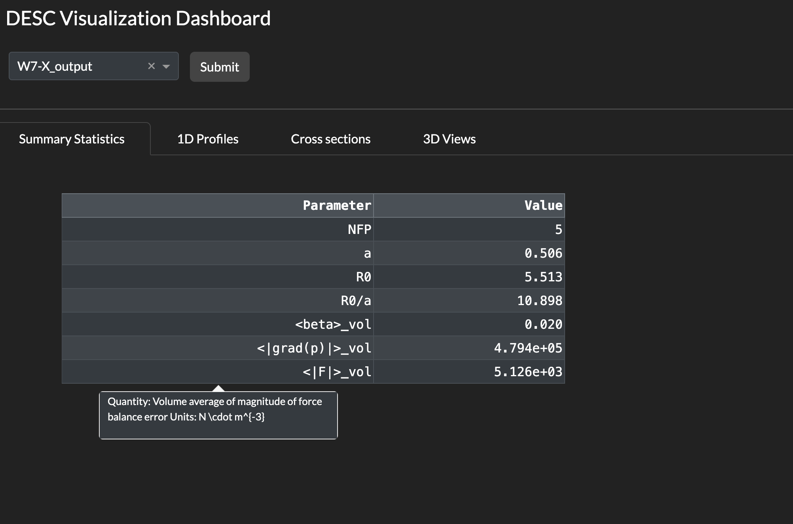
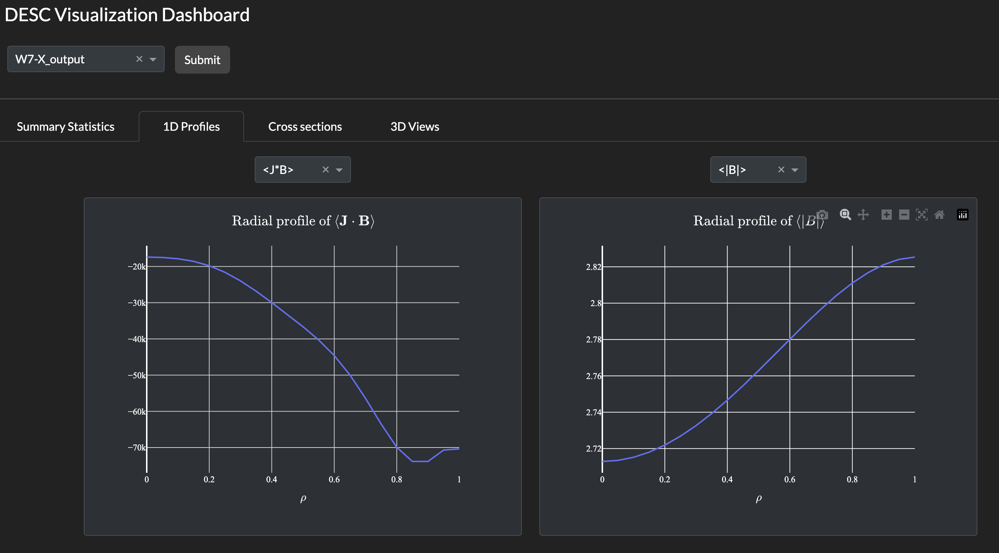
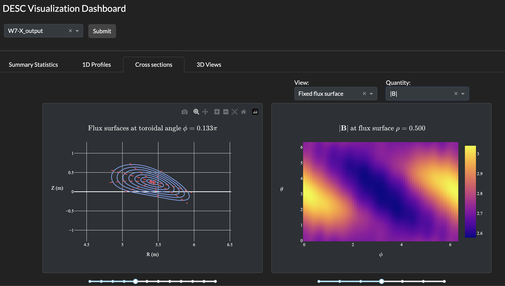
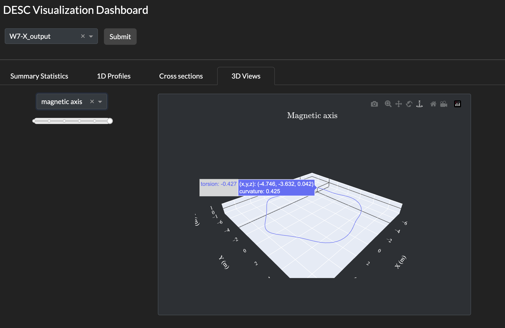

# Visualization dashboard for DESC

An interactive application for visualizing three dimensional, toroidal magnetic fields. The dashboard is built in [Dash](https://dash.plotly.com/), and is compatible with outputs of the [DESC](https://github.com/PlasmaControl/DESC) code. 

Key features:
- Accepts 'X.h5' files storing Equilibrium or EquilibriumFamily objects from DESC
- Uses DESC's API to compute and store quantities of interest:
    - scalar figures of merit ($\beta$, MHD force error, ...)
    - functions of the flux surface label (pressure, rotational transform, ...)
    - 2D flux surfaces on fixed toroidal slices
    - 2D heatmaps of functions on fixed flux surface or on fixed toroidal slice (current and magnetic field densities, ... )
    - 3D flux surfaces, and the magnetic axis
    - 3D heatmaps of functions on fixed flux surface (current and magnetic field densities, ... )
- At runtime, loads computed quantities into a browser Dash app. User can select different quantities to plot, and cycle through equilibria

# Instructions 

## Step 1. Setup

Clone the repository and set up an appropriate Python environment (eg. using venv). Install the modules `desc-opt`, `dash`, and `dash-bootstrap-components`. Using pip, one can just run 

`pip install desc-opt dash dash-bootstrap-components`

After navigating to the repository in your terminal, you will see `/equilibria` and `/src` folders. In `/equilibria/desc_files`, add the .h5 files from DESC corresponding to your equilibria. Some examples are already included. 

### Optional
Nagivate to `/src/constants.py`. There will be a list of the quantities which are precomputed, using notation from DESC's [documentation](https://desc-docs.readthedocs.io/en/latest/variables.html). The list can be modified as desired. 

In the same file will be variables `base_desc_path` and `pp_desc_path`. These are the paths where the code looks for the .h5 files from DESC, and the preprocessed files, respectively. 

## Step 2. Preprocessing

Running 

`python preprocess.py` 

will scan through the equilibria you have loaded in `/equilibria/desc_files` (more generally, `base_desc_path`). The script loads the equilibria, computes any quantities which are needed, and stores the output in a .h5 file in `/equilibria/preprocessed` (or `pp_desc_path`).

Other options include

`python preprocess.py --list`, which lists the equilibria which have been processed.

`python preprocess.py --clear`, which removes the preprocessed files. 

`python preprocess.py --clear+`, which removes the preprocessed files and then runs the main script.

## Step 3. Running the Dash app

The Dash app is now quite simple to run, using 

`python app.py`

The terminal will output "initializing," and list the port from which the app is running. For example, the default is 

`http://127.0.0.1:8050/`

Navigating to this address in a browser should show the app.

# Gallery
App running on the W7-X equilibrium, taken from the DESC repo [here](https://github.com/PlasmaControl/DESC/tree/master/desc/examples).

 

 

 

 

 

# Key Dependencies
This repository relies heavily on the following open source projects:
- [DESC](https://github.com/PlasmaControl/DESC) (MIT License)
- [Dash](https://github.com/plotly/dash) (MIT License)
- [Dash Bootstrap Components](https://github.com/dbc-team/dash-bootstrap-components) (Apache-2.0 License)
- [Plotly](https://github.com/plotly/plotly.py) (MIT License)

